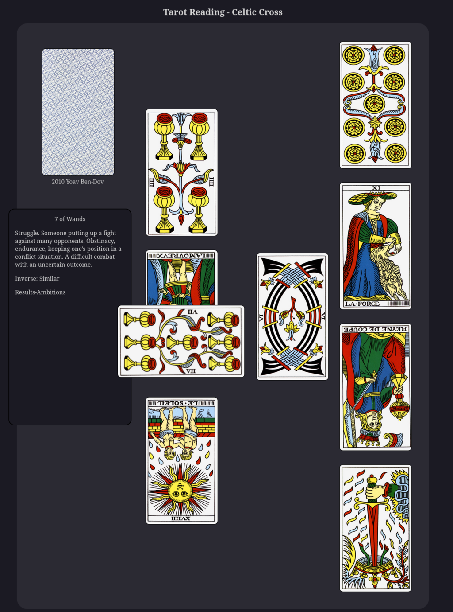

# Tarot-Reading-Web
Simple Tarot reading using HTML, CSS, JavaScript, 
and public domain card images.

Picks a random deck out of those provided. Clicking on the deck deals the cards
one by one to their positions in the layout. When the last card is dealt the
deck will dim.  Clicking on the dimmed deck will reload the page selecting a new
deck to deal from. Reloading the page will also select a new random deck
(possibly the same one).

Clicking on a card flips it over and provies it's meanings. The meanings for the
Waite-Smith deck are from A. E. Waite. The Tarot de Marseille meanings are from
Yoav Ben-dov.

Included decks:
- [1760 Nicolas Conver](https://gallica.bnf.fr/ark:/12148/btv1b10520316w)
- [1880 Carlo Dellarocca](https://www.britishmuseum.org/collection/object/P_1896-0501-12)
- [1909 Rider-Waite-Smith](https://en.wikipedia.org/wiki/Rider%E2%80%93Waite_Tarot)
- [2010 Yoav Ben-Dov (Conver restoration)](https://cbdtarot.com/the-cards/)

To install and run:
```
git clone https://github.com/ligelowbee/Tarot-Reading-Web.git
cd Tarot-Reading-Web
firefox tarot-cross.html
```


